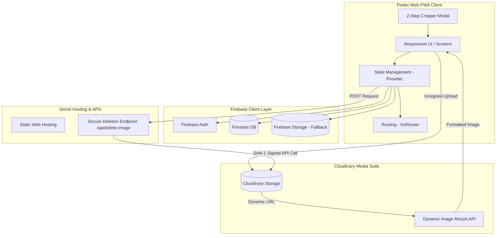

# Technical Architecture & Planning Document: Premium Catalog PWA

This document outlines the detailed system architecture, codebase structure, data models, and service flows of the platform. Use this as a reference guide for future development, cloning, or refactoring.

---

## 1. System Architecture Overview

The system follows a modern serverless PWA architecture combining Flutter Web, Firebase for database/fallback storage, Cloudinary for high-performance media delivery, and Vercel for hosting and secure serverless operations.



---

## 2. Directory Structure & Code Organization

The codebase is organized following standard Clean Architecture guidelines for Flutter projects:

```
lib/
│
├── models/                     # Data Models (JSON Serialization & Mappings)
│   ├── product.dart            # Product entity with CloudinaryImage list
│   ├── department.dart         # Business Segments (e.g. Men, Women)
│   ├── category.dart           # Taxonomy Categories
│   ├── subcategory.dart        # Taxonomy Subcategories
│   ├── hero_banner.dart        # Home Carousel Hero Banner
│   ├── business_settings.dart  # Contact details & Cloudinary keys
│   └── cloudinary_image.dart   # Image metadata (URL, publicId, dimensions)
│
├── providers/                  # State Management (ChangeNotifiers)
│   ├── catalog_provider.dart   # Customer catalog (filtering, sorting, search)
│   ├── business_provider.dart  # Global settings & business metadata
│   └── admin_provider.dart     # Admin CRUD & secure image deletions
│
├── services/                   # Backend Interfaces
│   ├── firestore_service.dart  # Firestore CRUD & stream streams
│   ├── image_service.dart      # Upload selector / fallback uploader
│   └── cloudinary_service.dart # Upload/Delete API wrapper
│
├── router/                     # Navigation Configuration
│   └── app_router.dart         # GoRouter configurations with deep-linking
│
├── widgets/                    # Reusable Presentation Components
│   ├── navbar.dart             # Responsive header navigation
│   ├── footer.dart             # SEO-friendly clickable contact footer
│   ├── product_card.dart       # Responsive Grid Product Card
│   ├── whatsapp_button.dart    # WhatsApp query template formatter
│   ├── free_cropper_modal.dart # Step 1: Draggable free cropper
│   └── image_cropper_modal.dart# Step 2: Aspect ratio cropper
│
└── screens/                    # View pages (Customer & Admin sections)
```

---

## 3. Database Layer (Firestore Schema)

Firestore stores catalog meta-information. Direct assets are stored in Cloudinary, referencing only their URLs and `public_id`s in Firestore.

### Collections Structure

#### 1. `products`
```json
{
  "id": "firestore_doc_id",
  "title": "Mens Premium Cotton Polo",
  "slug": "mens-premium-cotton-polo-12345",
  "sku": "OMT5017",
  "price": "₹450 / Piece",
  "offerPrice": 399.0,
  "description": "Premium quality export polo shirt...",
  "departmentId": "dept_id",
  "categoryId": "cat_id",
  "subcategoryId": "sub_id",
  "availableSizes": ["M", "L", "XL"],
  "isFeatured": true,
  "isOffer": false,
  "images": [
    {
      "publicId": "hashzone/products/a1b2c3d4",
      "url": "https://res.cloudinary.com/...",
      "width": 1200,
      "height": 1600,
      "format": "png",
      "isCover": true,
      "displayOrder": 0
    }
  ],
  "specifications": {
    "Fabric": "100% Combed Cotton",
    "Gsm": "220 GSM"
  },
  "tags": ["Polo", "Summer", "Casual"],
  "createdAt": "Timestamp"
}
```

#### 2. `departments`
```json
{
  "id": "firestore_doc_id",
  "name": "Men",
  "isSizeApplicable": true,
  "order": 1
}
```

#### 3. `categories`
```json
{
  "id": "firestore_doc_id",
  "departmentId": "dept_id",
  "name": "T-Shirts",
  "imageUrl": "https://res.cloudinary.com/...",
  "order": 0
}
```

#### 4. `settings` (Document: `business`)
Stores company configurations dynamically so details can be updated via the admin dashboard without rebuilding the code:
```json
{
  "whatsAppNumber": "+919884875578",
  "contactNumbers": ["+919884875578"],
  "email": "Smtind20@gmail.com",
  "storeAddress": "29 TNK Puram, 3rd Kongu Main Road...",
  "googleMapsUrl": "https://maps.google.com/...",
  "announcementText": "WELCOME TO HASH ZONE",
  "cloudinaryCloudName": "um227ll2",
  "cloudinaryUploadPreset": "hashzone_products",
  "cloudinaryFolder": "hashzone/products"
}
```

---

## 4. Media Optimization Pipeline (Cloudinary)

Instead of using raw, uncompressed images, the app runs all media through Cloudinary:

```
[Uploaded Image] ➔ [Cloudinary CDN] ➔ [Dynamic Cloudinary URL] ➔ [On-The-Fly Crop / Resize] ➔ [Client Device]
```

1. **Unsigned Upload**: Flutter client uploads directly to Cloudinary using an unsigned upload preset.
2. **Flexible Image Sizing**: In `CloudinaryImageWidget`, the URL is parsed to automatically add transformation parameters for different devices:
   *   Product Cards: Adds `/c_fill,g_auto,w_400,h_533,q_auto,f_auto/` for responsive grid loads.
   *   Details Page: Loads `/c_limit,w_1200,q_auto,f_auto/` for high-resolution zooming.
   *   Banners: Loads `/c_fill,w_1920,h_822,q_auto,f_auto/`.

---

## 5. Secure Deletion Pipeline (Vercel Backend)

Cloudinary requires private credentials to delete files. To prevent exposing these keys in Flutter web code, Vercel hosts a secure Node.js serverless handler:

### Deletion Flow
1. Admin triggers a delete operation on a product or hero banner.
2. Client sends an HTTP POST request containing `{"public_id": "..."}` to the relative serverless path `/api/delete-image`.
3. Vercel receives the request, signs it with SHA-1 using private environment keys (`CLOUDINARY_API_KEY`, `CLOUDINARY_API_SECRET`), and sends the request to Cloudinary:
   ```
   https://api.cloudinary.com/v1_1/<CLOUD_NAME>/image/destroy
   ```
4. Cloudinary deletes the asset and Vercel returns `{"result": "ok"}` to the client.

---

## 6. Two-Step Image Processing Pipeline

To guarantee pixel-perfect content formatting, all upload buttons use a chained modal pipeline:

```
[Pick File] ➔ [HZFreeCropperModal] ➔ [HZImageCropperModal] ➔ [Upload to Cloudinary]
```

1. **HZFreeCropperModal (Step 1)**: Allows free-style cropping by dragging boundaries to remove background elements or focus on a product. Runs on a high-fidelity `ui.PictureRecorder` canvas to prevent scaling/blurring issues.
2. **HZImageCropperModal (Step 2)**: Receives the cropped image bytes from Step 1 and displays alignment guidelines matching the target display aspect ratio (`3:4` for products, `21:9` for banners, `1:1` for categories).

---

## 7. Progressive Web App (PWA) Specs
*   **Web Manifest**: `web/manifest.json` configures the app to load as a standalone application on mobile devices.
*   **Color Matching**: PWA background is `#ffffff` (white) for a seamless brand splash logo blend, and the theme status bar color is `#000000` (black) for a premium dark layout.
*   **SEO Setup**: Deep-linking allows search engines to index individual paths. Dynamically generated headers and a Vercel-served dynamic XML Sitemap ensure optimal search engine rankings.
