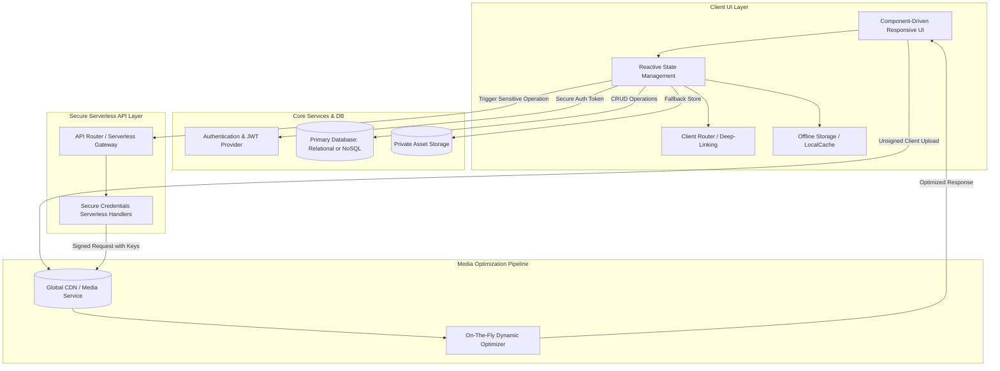

# General Web Application Architecture & Planning Blueprint

This document serves as a reusable system architecture blueprint and planning template for building any modern, high-performance, secure, and fully responsive web application. Use this document to plan database structure, API routing, media pipelines, and frontend layouts.

---

## 1. Generalized Architecture Diagram

Modern web applications should decouple the client UI layer, database operations, static asset CDNs, and secure backend operations (serverless/microservices).

---

## 2. Frontend Layer Planning & Architecture

### A. Design System & Aesthetics
*   **Typography**: Select a primary font for headings (expressive, premium) and a secondary clean font for body text (highly readable, e.g., Inter, Outfit).
*   **Tokens**: Establish global CSS variables/Dart theme classes for colors, shadows, borders, transitions, and padding to ensure visual consistency.
*   **Theme Mode**: Define support for light, dark, or system-preferred layouts.
*   **Hover states & Micro-animations**: Build subtle transitions (fade-in, scale-up, color shifts) for interactive components to elevate user perception of speed and quality.

### B. Client-side Navigation & SEO
*   **Routing Structure**: Implement declarative routing (e.g. `go_router` or React Router) with clean URL slugs (e.g., `/item/:id-slug`) rather than query parameters.
*   **Dynamic Head Tag Management**: Ensure page titles, meta descriptions, and OpenGraph/Twitter cards update dynamically upon navigation.
*   **Sitemap Handler**: Generate and expose an automated sitemap.xml dynamically updated as database rows change.

---

## 3. Database & Storage Architecture Planning

### A. Schema Planning Guide
When planning the data layer, structure collections/tables by access pattern rather than theoretical relationships:
1.  **Read-Heavy Entities (e.g., Catalog, Articles)**: Denormalize fields so a single document/row fetch retrieves all information required for the UI page (avoiding expensive nested joins).
2.  **Write-Heavy Entities (e.g., User Carts, Profile Logs)**: Keep schemas small, indexed, and separate to minimize lock times and ensure high concurrency.
3.  **App Configuration**: Store global variables (business contact details, feature flags) in a separate settings document to allow adjustments without redeploying code.

### B. Indexing Guidelines
*   **Single-Field Indexes**: Always index fields frequently used in sort operations, search queries, or filter flags.
*   **Composite Indexes**: Create composite indexes for queries that filter by multiple parameters simultaneously (e.g. `where category == X and price <= Y order by date`).

---

## 4. Secure Backend Credentials Pipeline (Serverless)

**Critical Architecture Rule**: Never store private API secrets (e.g. Cloudinary secrets, Stripe keys, AWS access tokens) inside the client-side codebase.

### Secure Execution Flow:
1.  **Trigger**: The client makes a secure HTTP POST request to a serverless endpoint (hosted on Vercel, AWS Lambda, or Firebase Functions).
2.  **Authentication**: The serverless handler validates the client request (e.g. checks JWT tokens or verified admin state).
3.  **Signature Generation**: The serverless handler securely retrieves private keys from server-side environment variables and performs the cryptographic signature (e.g. HMAC-SHA256).
4.  **Backend Dispatch**: The signed request is sent directly from the serverless environment to the third-party service provider.
5.  **Clean Response**: Return only the clean result to the client (filtering out any secret headers or keys).

---

## 5. Media & Asset Delivery Pipeline (CDN)

For premium performance, never serve raw uploaded images directly.

### Image Pipeline Specs:
*   **Client Upload**: Implement direct client-to-CDN unsigned uploading using temporary presets to save server bandwidth.
*   **Caching Headers**: Configure media assets to return aggressive caching policies (`Cache-Control: public, max-age=31536000`).
*   **On-The-Fly Resizing**: Use a media CDN (Cloudinary, Imgix, or Vercel Images) to dynamically scale and format images on the fly based on the user's screen width:
    *   *Grid Card*: Output width restricted to ~400px.
    *   *Detail View*: Limit width to ~1200px.
    *   *Formats*: Always request auto-format selection (`f_auto`) to dynamically serve `AVIF` or `WEBP` depending on browser support.

---

## 6. Progressive Web App (PWA) Specifications

To make any web application behave like a native mobile or desktop app:
1.  **Web App Manifest**: Configure `manifest.json` with app icons, display mode (`standalone`), scope (`/`), and start URL.
2.  **Splash & Theme Matching**: Define theme and background colors. Splash screen background must match the logo backdrop to prevent visual flashing during load.
3.  **Service Worker Lifecycle**: 
    *   Implement cache-busting strategies so users automatically receive application updates without needing manual page refreshes.
    *   Configure asset pre-caching for core layout shell files (HTML, CSS, JS, Fonts) to enable instant loads.

---

## 7. Deployment & CI/CD Planning

*   **Branching Workflow**: Use a main branch linked to Vercel/Netlify/Firebase hosting for automatic production deployments, and a development branch for testing.
*   **Environment Variables**: Distinguish between development, staging, and production keys (databases, API URLs) using localized `.env` configurations.
*   **Automated Builds**: Integrate lint checks, type validations, and test suites in a GitHub Actions workflow that blocks pushes if the build fails.
